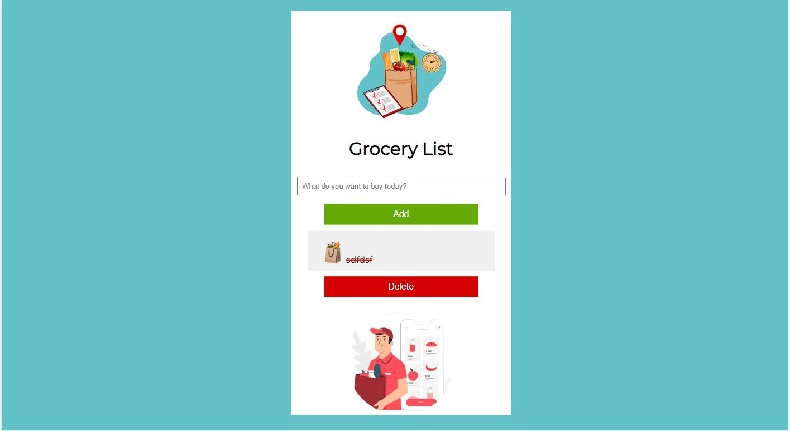

  <h1>Grocery List</h1> 
  

<!-- ABOUT THE PROJECT -->
## About The Project

Simple React application like a to-do list app

  

    <a href="https://grocery-react.netlify.app/">View Demo Here</a>
  

## Built With

[React](https://reactjs.org/) / [JavaScript](https://www.w3schools.com/js/)
 
<!-- USAGE EXAMPLES -->
## Usage

The usage is pretty simple.

User can type what he needs to buy into th input field and press Add or hit Enter.

Once user submitted an item, he will see it appear as an entry.

Click on the item and it will be crossed out.

User can add as many items as he wants and can also remove them.

Project Link: https://github.com/kateFrontend/Grocery-List
